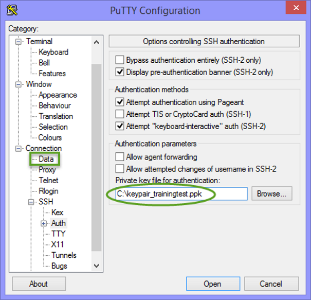

Zugriff auf eine Instanz über SSH
=================================

Zugriff auf eine Instanz
------------------------

Der Zugang zu einer Instanz kann auf verschiedene Arten erfolgen. Wie hängt im Wesentlichen vom Betriebssystem ab, aber auch vom Client-Betreibssystems, mit dem auf die Instanz zugregriffen wird.

**Voraussetzungen**

Bevor Sie auf eine Instanz über SSH zugreifen können, müssen folgende Voraussetzungen erfüllt sein: 

* Im Zusammenhang mit dem Netzwerk:
* Das Subnetz wurde festgelegt
* Der Router für das Subnetz wurde festgelegt
* Die Schnittstelle für den Router wurde festgelegt
* Die Instanz befindet sich in einem Subnetz, das durch einen Router mit dem öffentlichen Netzwerk verbunden ist. Sie ist somit von ausserhalb erreichbar.
* Der öffentliche Schlüssel wurde hochgeladen und der Instanz beim erstmaligen Erstellen zugewiesen.
* Die Floating IP wurde der Instanz zugewiesen
* Der Verkehr über TCP Port 22 (SSH) zur Instanz wurde in der Sicherheitsgruppe, die der Instanz zugewiesen wurde, zugelassen.

Zugriff auf eine Linux-Instanz über Pageant
^^^^^^^^^^^^^^^^^^^^^^^^^^^^^^^^^^^^^^^^^^^

1. Stellen Sie sicher, dass der private Schlüssel Ihres Schlüsselpaares im Format .ppk ist.
2. Öffnen Sie Pageant.

.. image:: _static/access/fig1.png
                  :alt: Pageant 

3. Klicken Sie auf die Schaltfläche **Add Key** um den privaten Schlüssel (Format .ppk) zu Pageant hinzuzufügen (Geben Sie wenn nötig die Passphrase ein).
4. Der Schlüssel sollte nun in der Pageant-Liste auftauchen.

5. Klicken Sie auf die Schaltfläche **Close**. Pageant läuft weiterhin im Hintergrund.
6. Öffenen Sie nun PuTTY. Geben Sie die Adresse der Floating IP in das Feld **Host Name** ein und klicken Sie auf **Open**.

				  
7. Falls Sie nach einem Benutzernamen gefragt werden, geben Sie denjenigen ein, der im Fenster **Image Detail** stand. Klicken Sie auf **Return**. Sie sind nun in Ihre Linux-Instanz eingeloggt.

				  
Zugriff auf eine Linux-Instanz über PuTTY (Manuelle Konfiguration)
^^^^^^^^^^^^^^^^^^^^^^^^^^^^^^^^^^^^^^^^^^^^^^^^^^^^^^^^^^^^^^^^^^

1. Öffnen Sie PuTTY.
2. Geben Sie die Adresse der Floating IP in das Feld **Host Name** ein. Klicken Sie danach auf **Auth** im Menü Connection/SSH.

				  
3. Klicken Sie auf **Browse**, suchen Sie Ihren Schlüssel im Format .ppk und wählen Sie ihn aus. Danach klicken Sie auf **Data** im Menü Connection. 

				  
4. Geben Sie in das Feld **Auto-login username** 'cloud-user' ein und klicken Sie auf **Open**.

.. image:: _static/access/fig7.png
                  :alt: PuTTY configuration Connection Data

				  
5. Damit öffnen Sie das Sitzungsfenster.

.. image:: _static/access/fig8.png
                  :alt: PuTTY configuration Connection Data

				  
Zugriff auf eine Linux-Instanz über SSH bei Benutzung eines Schlüsselpaars in Linux
^^^^^^^^^^^^^^^^^^^^^^^^^^^^^^^^^^^^^^^^^^^^^^^^^^^^^^^^^^^^^^^^^^^^^^^^^^^^^^^^^^^

Wenn Sie auf eine Instanz von einem lokalen Linux-Client über SSH zugreifen wollen, müssen Sie die Datei mit dem privaten Schlüssel (.pem) im Linux-Client abgelegt und die Dateizugriffsrechte für eine SSH-Verbindung zur Instanz konfiguriert haben. Die Zugriffsrechte konfigurieren Sie, wenn Sie den Schlüssel mit Hilfe von ssh-keygen erstellen. Sollten Sie eine andere Methode zur Erstellung des Schlüssels (Dashboard, PuTTY usw.) benutzen, dann vergewissern Sie sich bitte, dass Sie ihn richtig in den Linux-Client kopiert haben und die Zugriffsrechte korrekt sind.

1. Öffnen Sie ein Terminalfenster
2. Verbinden Sie sich mit der Instanz über SSH, indem Sie das Schlüsselpaar benutzen. Der Benutzer ist der im Image festgelegte lokale Benutzer der Instanz.

	ssh –i / *PrivateKeyPath/PrivateKeyFile UserOfTheInstance@IPaddress*

3. Die Command-Line-Verbindung mit der Instanz ist nun erstellt.

				  
