Schlüsselpaare
==============

.. note::
   Benutzen Sie unbedingt ein SSH-Schlüsselpaar, um das erste Mal auf eine auf Linux basierte Instanz zuzugreifen. Dies gilt nur für die Linux-Images, die von Cloudlynx bereitgestellt werden.

Mit SSH Schlüsselpaaren ist es möglich sicher auf Instanzen zugreifen, ohne jedes Mal ein Passwort eingeben zu müssen. Ein einziges Schlüsselpaar kann für mehrere zum gleichen Projekt gehörende Instanzen benutzt werden.

Schlüsselpaare können auf drei verschiedene Arten generiert werden. Eine Möglichkeit ist die Erstellung direkt über das Cloudlynx-Dashboard mit Hilfe eines Drittanbieter-Tools wie der Open-Source-Software PuTTYgen. Dies gilt für Windows-Clients; bei einem Linux-Client werden die CLI SSH Befehle benutzt.

Generierung eines Schlüsselpaars mit PuTTYGen
---------------------------------------------

1. Öffnen Sie PuTTYGen und klicken Sie auf „Generate“. Sie werden danach aufgefordert, den Cursor über das leere Feld hin und her zu bewegen, um Zufall zu erzeugen („Please generate some randomness by moving the mouse over the blank area.“) Bewegen Sie die Maus so lange, bis Sie die Meldung „Please wait while a key is generated“ erhalten.

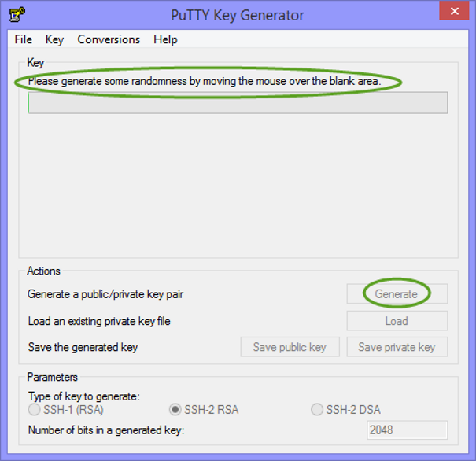

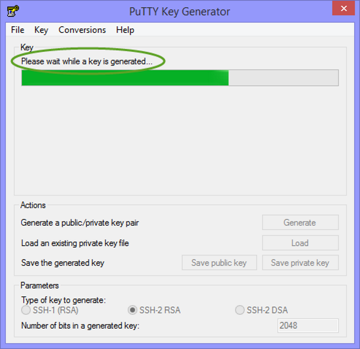

2. Sobald der Schlüssel erzeugt ist, erscheint er im Generator-Fenster.

3. Wählen Sie alles aus, was im Feld „Public key for pasting into OpenSSH authorized_keys file“ steht, und kopieren Sie es in die Zwischenablage.

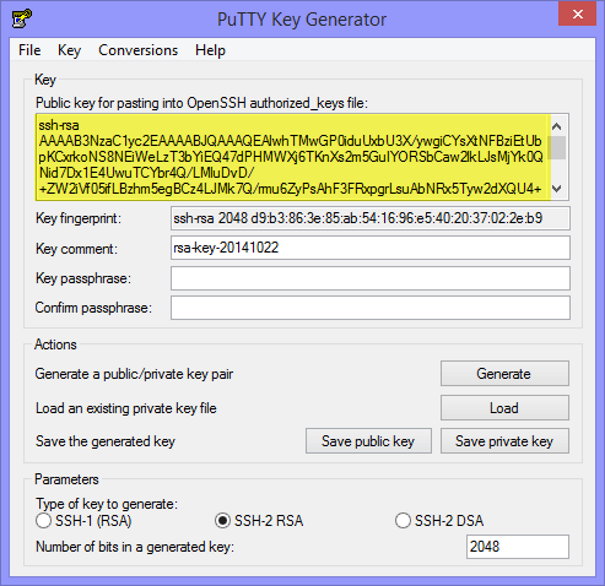

4. Kicken Sie auf „Save private key“ und folgen Sie den Anweisungen. Der Schlüssel, den sie später für den Zugang über SSH benötigen, ist nun erzeugt.

Importieren des Schlüsselpaars
""""""""""""""""""""""""""""""

5. Der öffentliche Schlüssel muss danach in das Dashboard importiert werden. Klicken Sie zuerst auf „Access & Security“, dann auf „Keypairs“ und schliesslich auf „Import Keypair“.

.. image:: _static/keypairs/fig4_puttygen.png
               :alt: Access and Security

6. Kopieren Sie den von PuTTYGen generierten Schlüssel in das Feld „Public Key“ und klicken Sie ins Feld„Import Keypair“.

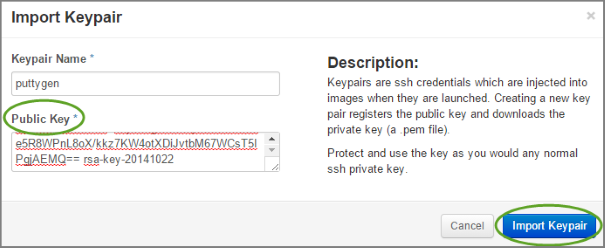

7. War der Import erfolgreich, sollten Sie folgende Meldung sehen

Generierung eines Schlüsselpaars über das Dashboard
---------------------------------------------------

.. note::
   Der private Schlüssel wird im Browser erzeugt. In der Cloud wird keine Kopie generiert, auch gibt es keine Möglichkeit den Schlüssel wiederherzustellen – das heisst, der von Ihnen gespeicherte Schlüssel mit der Endung .pem ist das einzige vorhandende Exemplar. Behandeln Sie ihn daher wie Ihren eigenen Hausschlüssel und verlieren Sie ihn nicht!

1. Gehen Sie zum Reiter „Access & Security“ unter „Manage Compute“ in der Seitenleiste.
2. Klicken Sie auf den Reiter „Keypairs“. Hier sind Sie alle für das Projekt verfügbaren Schlüsselpaare aufgelistet. Die Liste ist standardmässig leer. Ein Schlüsselpaar muss zuerst erzeugt oder importiert werden, damit dieses auch gelistet wird.
3. Klicken Sie auf die Schaltfläche „Create Keypair“.
4. Geben Sie dem Schlüsselpaar einen Namen, zum Beispiel „Mills_Evan_Keypair“.
5. Klicken Sie auf die Schaltfläche „Create Keypair“ im Dialogfenster.
6. Der private Schlüssel kann nun heruntergeladen werden (möglicherweise gibt Ihnen der Browser verschiedene Möglichkeiten zum Download). Cloudlynx speichert nur den öffentlichen Schlüssel.
7. Das Schlüsselpaar erscheint nun in der Liste mit allen verfügbaren Schlüsselpaaren unter „Access & Security“ > „Keypairs“.

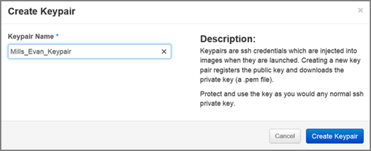

Generieren eines Schlüsselpaare mit Linux
-----------------------------------------

1. Öffnen Sie ein Terminalfenster, geben Sie den unten stehenden Befehl ein und führen Sie die folgenden Anleitungen durch:

        $ ssh-keygen –b 4096 –t rsa –C training

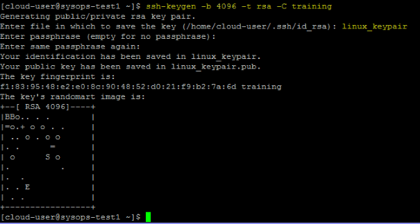

2. Fügen Sie den SSH-Schlüssel dem ssh-Agent zu, indem Sie den folgenden ssh-add Befehl eingeben:

        $ ssh-add linux_keypair

3. Je nachdem, welchen Linux-Server Sie benutzen, kann es geschehne, dass Sie nun Fehlermeldungen erhalten, zum Beispiel: 

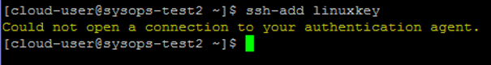

4. Wenn Sie diese Meldung erhalten, geben Sie folgenden Befehl ein (er fordert den ss-Agent sozusagen zur Kommunikation auf:

        $ eval $(ssh-agent)

5. Versuchen Sie es nun noch einmal mit dem ssh-add Befehl 

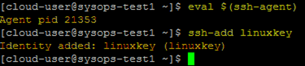

6. Schneiden Sie den öffentlichen Schlüssel aus und fügen Sie den ganzen (!) Inhalt ein. Für den Fall, dass Sie nicht wissen, wo ihr Schlüssel aufbewahrt ist, benutzen Sie den folgenden Befehl: $ sudo find / -name <name of your keypair>

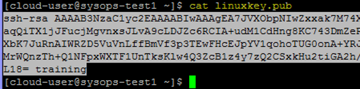

Importieren des Schlüsselpaars
""""""""""""""""""""""""""""""

7. Importieren Sie den Schlüssel über das Dashboard

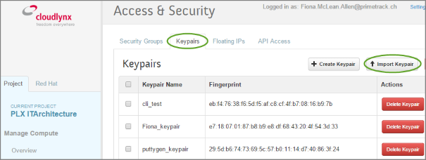

8. Kopieren Sie ihn in das Dashboard und klicken Sie auf „Import Key“.

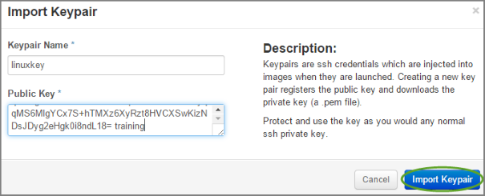
