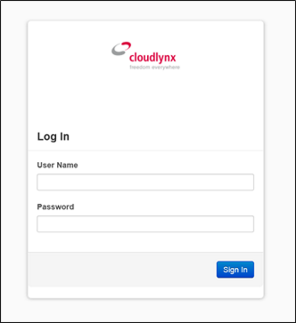
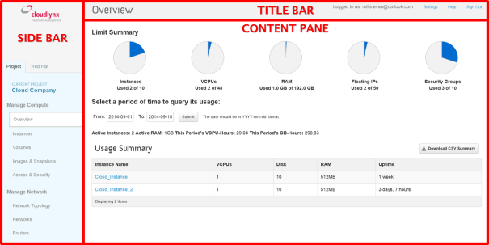
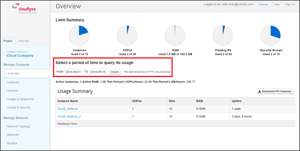
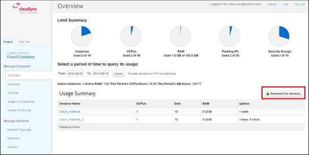
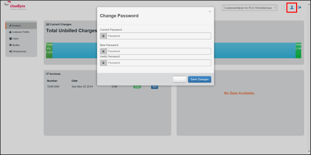

Das Cloudlynx-Dashboard
-------------------
Das Cloudlynx-Dashboard ist das erste, was Sie sehen, wenn Sie auf das graphische Interface von Cloudlynx (GUI) zugreifen. Hier finden Sie einen Überblick über die aktuellen Cloud-Ressourcen sowie alle von Cloudlynx angebotenen Dienstleistungen.

Das Cloudlynx-Dashboard Login
^^^^^^^^^^^^^^^^^^^^^^^^^^^^^

Um sich sich in das Cloudlynx-Dashboard einzuloggen, können Sie entweder den Link in der Willkommens-Email oder den auf unserer Webseite benutzen. Die Login-Daten werden Ihnen während des Registrationsprozesses zugeteilt.

.. note::
   Der Registrationsprozess wird in dieser Dokumentation nicht behandelt. Informationen zu diesem Thema finden Sie unter https://preview.cloudlynx.ch/account/register.

.. note::
   Sollten Sie Ihr Passwort vergessen haben, können Sie in der Accountverwaltung unter https://preview.cloudlynx.ch/account ein neues anfordern.

Überblick über das Cloudlynx-Dashboard
^^^^^^^^^^^^^^^^^^^^^^^^^^^^^^^^^^^^^^

Nach erfolgreichem Einloggen in das Cloudlynx-Dashboard werden Sie zur Seite „Overview“ weitergeleitet. Auf dieser Seite haben Sie einen Überblick über alle Ressourcen in der Cloud: Sie finden hier Ihre Limiten und gegenwärtig genutzte Ressourcen, können aber auch den alten Stand Ihrer Nutzung abfragen.

Das Cloudlynx-Dashboard besteht aus drei Teilen:

* Die Seitenliste (auf der linken Seite des Bildschirms)
* Das Inhaltsfenster (mittig)
* Die Titelleiste (oberster Teil)

Die Seitenliste
"""""""""""""""

.. note::
   Der Red-Hat-Reiter leitet Sie auf das Red-Hat-Kundenportal weiter. Da dieses Feature jedoch in späteren Updates entfernt werden wird, sollten Sie es nicht benutzen. Um auf diesen Bereich zugreifen zu können, benötigen Sie ein Konto von Red Hat.
 

Auf der linken Seite des Cloudlynx-Dashboards, der Seitenleiste, finden Sie alle von Cloudlynx angebotenen Dienstleistungen sowie Ihr aktuelles Projekt. 

Die Seitenleiste hat die folgende Struktur:

**Manage Compute**

* Overview: Überblick über die aktuelle Ressourcennutzung
* Instances: Erstellen und Verwalten von Instanzen
* Volumes: Erstellen, Zuordnen und Verwalten von persistenter Datenspeicherung
* Images & Snapshots: Erstellen, Hochladen und Verwalten von Images und Snapshots
* Access & Security: Sicherheitskonfiguration und Zugang zu Instanzen

**Manage Network**

* Network Topology: grafischer Überblick über die Netzwerkeinstellung
* Networks: Erstellen und Konfigurieren von virtuellen Netzwerken, Subnetzen, Gateways und IP-Allokationen
* Routers: Erstellen, Konfigurieren und Verbinden von Routern mit virtuellen Netzwerken

**Object Store**

* Containers: Erstellen, Hochladen und Verwalten von persistenter Datenspeicherung 

**Orchestration**

* Stacks: automatische Verwendung eines Cloud-Setups (mitsamt Compute, Block Storage, Object Storage, Network usw.) 

Das Inhaltsfenster
""""""""""""""""""

Hier finden Sie den wichtigsten Inhalt zu den spezifischen Themen, die Sie in der Seitenleiste ausgewählt haben. Auf der **Überblicksseite** können Sie sowohl den aktuellen als auch den alten Stand Ihrer Cloud-Nutzung abfragen und bequem exportieren. Wählen Sie einfach das Anfangs- sowie Enddatum der Nutzung aus und schicken Sie die Anfrage mit **Submit** ab. Danach werden Ihnen die Resultate angezeigt.

.. note::
   Die Daten müssen nach dem Format YYYY-MM-DD eingegeben werden.

Möchten Sie eine Zusammenfassung als CSV-Datei exportieren, klicken Sie einfach auf die **Schaltfläche CSV**. 

Die Titelleist
""""""""""""""

Zuoberst befindet sich die Titelleiste. Sie änderts sich bei Auswahl eines Themas nicht. 

* Logged in as: aktuell angemeldeter Benutzer
* Settings: Anpassen der Sprache, Zeitzone, Anzahl Positionen pro Seite sowie des Passwortes
* Help: Link zur offiziellen Dokumentation von OpenStack
* Sign Out: Beenden der aktuellen Sitzung

Änderung des Passwortes
"""""""""""""""""""""""

Ändern Sie das Passwort nicht über den **Settings** Link in der Titelleiste, sondern gehen Sie zur Accountverwaltung (https://preview.cloudlynx.ch/account). Nachdem Sie sich eingeloggt haben, klicken Sie auf das Symbol „User“ rechts oben und wählen **Change Password** aus. 
Es ist sehr wichtig, dass Sie beim Erstellen Ihrer Instanzen jeden Schritt sorgfältig und in der richtigen Reihenfolge ausführen. Nehmen Sie sich darum mit dem Durchlesen der Dokumentation unbedingt genügend Zeit.

.. _key-management:
