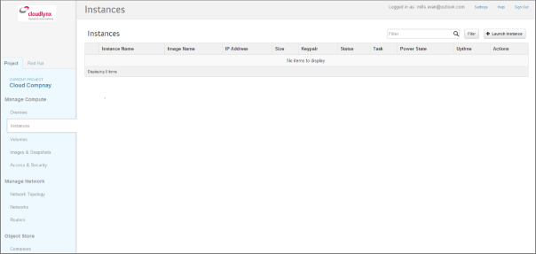
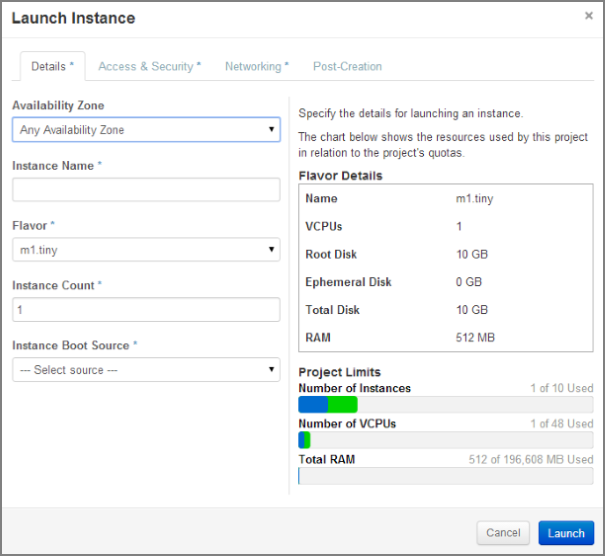
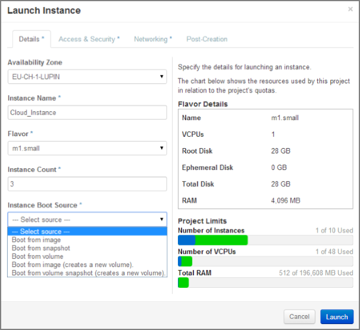
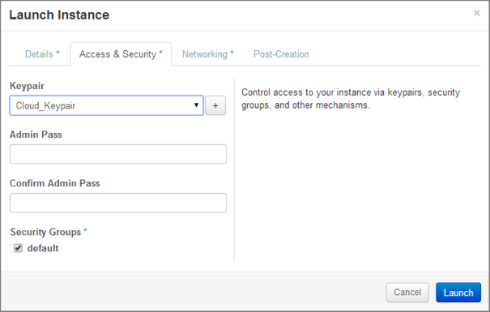
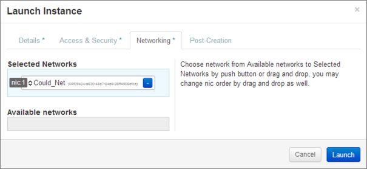
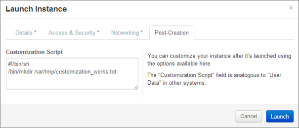
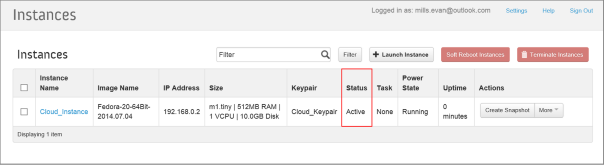

Start einer Instanz
===================

**Allgemeine Voraussetzungen**:

* Loggen Sie sich in das das Cloudlynx-Dashboard ein. 
* Konfigurieren Sie das Netzwerk, dem die Instanz zugewiesen werden soll.
* Finden Sie heraus, welches Boot-Medium Sie benutzen werden.
     * ein vordefiniertes Image von Cloudlynx
     * Ihr eigenes Image
     * eine Instanz, die aus einem bestehenden Snapshot gestartet wird
     * eine Instanz, die aus einem bestehenden Volume gestartet wird
* Ermitteln Sie die Anforderungen für die Instanz (RAM, CPU, Grösse der Boot Disk)

Start einer Instanz aus dem Dashboard
-------------------------------------

**Um eine Instanz aus dem Dashboard zu starten, gehen Sie folgendermassen vor:**

1. Gehen Sie in der Seitenleiste bei **Manage Network** zum Menüunterpunkt **Instances**.

2. Klicken Sie auf die Schaltfläche **Launch Instance** oben rechts. Nun erscheint das **Launch Instance**-Popup-Fenster.

3. Wählen Sie aus der Dropdown-Liste eine Verfügbarkeitszone für die Instanz. Damit legen Sie fest, wo sich die Instanz physisch befinden soll.
4. Füllen Sie nun das Feld **Instance Name** aus. Geben Sie der Instanz zur einfachen Unterscheidung einen eindeutigen Namen.
5. Wählen Sie ein Profil (Flavour) für die Instanz aus. Profile sind vordefiniert und legen die verfügbaren Compute-Ressourcen fest. Die Ressourcen für das ausgewählte Profil werden rechts im Teil **Flavour Details** angezeigt.
6. Um mehrere Instanzen zu starten, geben Sie im Feld **Instance Count** einen Wert ein, der grösser als eins ist.
7. Wählen Sie aus der Dropdown-Liste **Instance Boot Source** die Boot-Quelle der Instanz und geben Sie in die weiteren Felder die entsprechenden Angaben ein.

Sie können aus den folgenden Boot-Quellen wählen:

- **Boot from image** – Wählen Sie aus dem erscheinenden Fenster (**Image Name**) eine Instanz aus der Liste. 
- **Boot from snapshot** – Wählen Sie aus dem erscheinenden Fenster (**Instance Snapshot**) eine Instanz aus der Liste. 
- **Boot from volume** – Wählen Sie aus dem erscheinenden Fenster (**Volume**) eine Instanz aus der Liste. 
- **Boot from image** (creates a new volume) – Wenn Sie aus einem Image starten und ein Volume erstellen wollen, geben Sie hier die Grösse und den Namen für das Volume ein. Um das Volume beim Beenden der Instanz zu löschen, wählen Sie „Delete“ oder „Terminate“.
- **Boot from volume snapshot** (creates a new volume) – Wenn Sie aus einem Volume-Snapshot starten und ein Volume erstellen wollen, wählen Sie **Volume Snapshot** aus der Liste. Geben Sie dann dem Volume unter **Device Name** einen Namen. 

8. Klicken Sie auf den Reiter **Access & Security**.
9. Wählen Sie Ihr Schlüsselpaar aus der Liste.
10. Wählen Sie Ihre Sicherheitsgruppe.

11. Klicken Sie auf den Reiter **Networking**.
12. Wählen Sie das Netzwerk aus der Liste **Available networks**, entweder indem Sie beim entsprechenden Netzwerk auf die Schaltfläche **+** klicken, oder indem Sie das Netzwerk aus dem Feld **Available networks** in das Feld **Selected networks** ziehen.

.. note::
   Einer einzigen Instanz können mehrere Netzwerke zugewiesen werden.
 
13. Der Reiter **Post-Creation** gibt Ihnen die Möglichkeit, nach dem Start einer Instanz oder Instanzen Skripts zu benutzen (zum Beispiel Bash).

14. Klicken Sie auf die Schaltfläche **Launch**, um die Instanz zu starten.
15. Den Status der Instanz sehen Sie im Menüunterpunkt **Instances** unter **Manage Compute**.
16. Sobald die Instanz bereit ist, wechselt der Status zu **Active**.

