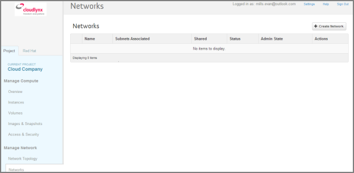
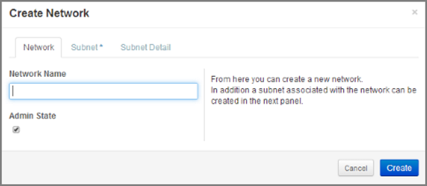
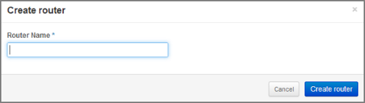
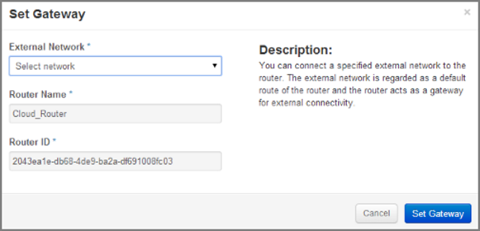
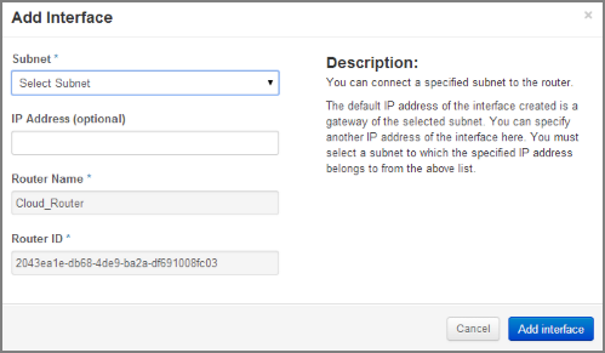
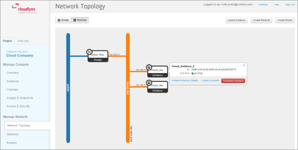
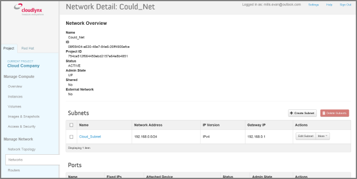

Netzwerk-Setup
==============

Erstellen eines Netzwerks und eines Subnetzes
---------------------------------------------

1. Gehen Sie in der Seitenleiste bei **Manage Network** zum Menü-Unterpunkt **Networks**.
2. Klicken Sie auf die Schaltfläche **Create Network**.

3. Nun erscheint ein Dialogfenster mit den Reitern **Network**, **Subnet** und **Subnet Detail**.

4. Geben Sie im Feld **Network Name** einen Namen für das neue Netzwerk ein. 
5. Das Feld **Admin State** ist standardmässig ausgewählt. Sollte dieses Feld kein Häkchen aufweisen, ist das Netzwerk nicht verfügbar und es werden keine Pakete übermittelt.
6. Klicken Sie auf den Reiter **Subnet**.
7. Geben Sie für das Subnetz einen Namen ein.
8. Geben Sie die IP-Adresse für das Subnetz ein (zum Beispiel 192.168.0.0/24).
9. Wählen Sie die IP-Version aus: IPv4 oder IPv6 (IPv6 ist momentan nicht verfügbar).
10. Geben Sie die IP-Adresse des Gateways ein. Dieser Parameter ist optional. Wird dieses Feld frei gelassen, wählt das System automatisch die erste Adresse im IP-Bereich des Subnetzes (zum Beispiel. 192.168.0.1).
11. Gehen Sie zum Reiter **Subnet Detail** und geben Sie dort weitere Eigenschaften für das Subnetz ein (optional).
12. Setzen Sie das Häkchen bei **Enable DHCP** um DHCP zu aktivieren.
13. Klicken Sie auf die Schaltfläche **Create** im Dialogfenster.
14. Das Netzwerk ist nun erstellt.
15. Sie finden es in der Netzwerkliste bei **Manage Network -> Networks**.

.. note::
   Um eine Instanz erstellen zu können, muss zuerst ein Subnetz festgelegt werden.

.. note::
   Ein Subnetz stellt einen IP-Adressen-Block dar, der für die Zuweisung von IP-Adressen zu virtuellen Instanzen benutzt werden kann. Jedes Subnetz muss eine Classless Inter-Domain Routing (CIDR) Adresse haben und mit einem zugeordneten Netzwerk verbunden sein. IP-Adressen können entweder aus dem gesamten CIDR des Subnetzes oder aus vom Benutzer festgelegten Zuweisungs-Pools ausgewählt werden.

.. note::
   Ein Subnetz kann wahlweise auch einen Gateway, eine Liste von DNS Name-Servern oder Host-Routen haben. Die Angaben werden an die mit dem Subnetz verbundenen Instanzen weitergeleitet.
	

Router-Setup
------------

Um eine Verbindung zwischen Subnetzen zu erstellen oder ein Netzwerk mit dem öffentlichen Netz zu verbinden, ist ein Router erforderlich. Erst dann kann auf die Instanzen über das Internet zugegriffen werden.

Erstellen eines Routers
"""""""""""""""""""""""

1. Wählen Sie in der Seitenleiste unter Manage Network den Reiter „Routers“ aus.
2. Klicken Sie auf die Schaltfläche „Create Router“.
3. Geben Sie im Dialogfeld „Create Router“ einen Namen für den Router ein.
4. Klicken Sie auf die Schaltfläche „Create Router“. Der neue Router erscheint nun im Reiter „Routers“.

Setzen eines Gateways
"""""""""""""""""""""

* Wählen Sie in der Seitenleiste unter „Manage Network“ den Reiter „Routers“ aus.
* Klicken Sie bei dem Router, für den Sie einen Gateway setzen wollen, auf die Schaltfläche „Set Gateway“.
* Geben Sie im Feld „External Network“ das Netzwerk ein, mit dem sich der Router verbinden soll (Meistens ist dies das öffentliche Netzwerk, also eine Verbindung zum Internet.).
* Klicken Sie auf die Schaltfläche „Set Gateway“.
	  

Verbinden eines privaten Netzwerks mit einem Router
"""""""""""""""""""""""""""""""""""""""""""""""""""

1. Wählen Sie in der Seitenleiste unter „Manage Network“ den Reiter „Routers“ aus.
2. Klicken Sie auf den Namen des Routers.
3. Klicken Sie auf der Seite „Router Details“ auf die Schaltfläche „Add Interface“.
4. Wählen Sie nun in der Dialogbox „Add Interface“ aus der Subnetz-Auswahlliste ein Subnetz aus.
5. Geben Sie für das ausgewählte Subnetz die entsprechende IP-Adresse ein.
6. Klicken Sie abschliessend auf die Schaltfläche „Add Interface“.
	  
.. note::
   Wurde kein spezieller IP-Adressenwert bestimmt, wird standardmässig die erste Host-IP-Adresse des Subnetzes benutzt.
	

Netzwerk-Topologie
""""""""""""""""""

Die Seite **Network Topology** ist eine grafische Überblicksdarstellung aller erstellten Netzwerke. Oben auf der Seite sehen Sie die folgenden Schaltflächen:
- **Launch Instance**
- **Create Network**
- **Create Router** 

Dort gibt es auch zwei Schaltflächen, die mit **Small** bzw. **Normal** bezeichnet sind. Mit diesen passen Sie die Ansicht der Netzwerk-Topologie an. Haben Sie zum Beispiel viele Netzwerke angelegt, können Sie mit **Small** die Fläche vergrössern. **Normal** hingegen zeigt Ihnen Angaben wie IP-Adressen und Namen.

Um die Angaben zu sehen, bewegen Sie einfach den Cursor über die Symbole **Instance** und **Router**. Damit können Sie auch gewisse Handlungen vornehmen, zum Beispiel:
- Instanzen beenden
- sich Einzelheiten zu Instanzen anzeigen lassen
- die Konsole öffnen
- einen Router löschen
- eine Schnittstelle löschen

Wenn Sie auf den Namen des Netzwerks klicken, öffnet sich die Seite **Network Detail**, die Ihnen einen Überblick über das Netzwerk, damit verbundener Subnetze sowie Ports gibt.

	 
Netzwerkeinzelheiten ansehen
""""""""""""""""""""""""""""

1. Wählen Sie in der Seitenleiste unter **Manage Network**, **Network Topology** aus.
2. Klicken Sie auf den Namen des Netzwerks, über das sie mehr wissen wollen.
3. Nun erscheint die Seite **Network Overview** des ausgewählten Netzwerks.

Von dieser Seite aus können Sie sowohl Subnetze erstellen, anpassen oder löschen, als auch Ports bearbeiten.
 

