Sicherheit
==========

Erstellen einer Sicherheitsgruppe (Security Group)
--------------------------------------------------

1. Klicken Sie auf den Menüunterpunkt **Access & Security**, den Sie unter **Manage Compute** finden.

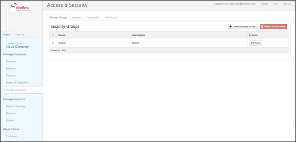

2. Klicken Sie auf die Schaltfläche **Create Security Group**.

3. Nun erscheint das **Create Security Group**-Popup-Fenster.

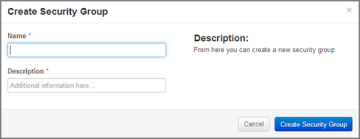

4. Geben Sie im Feld **Name** einen Namen für die Sicherheitsgruppe ein.
5. Im Feld **Description** können Sie die Sicherheitsgruppe näher beschreiben.
6. Danach klicken Sie auf die Schaltfläche **Create Security Group**.

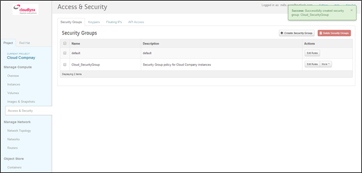

7. Die neue Sicherheitsgruppe erscheint in der Liste unter **Security Groups**.
  

Regeln für die Sicherheitsgruppen
---------------------------------

Passen Sie die Regeln einer Sicherheitsgruppe an, um über andere Ports und Protokolle auf die Instanzen zugreifen zu können.

**Folgende Parameter müssen für Regeln definiert werden:**

- **Destination Port On Instances** – Definieren eines Portbereichs. Geben Sie denselben Wert zweimal ein, wenn Sie einen einzigen Port öffnen wollen. Das Internet Control Message Protokoll unterstützt keine Ports. Geben Sie darum Werte ein, um die Codes und Typen des erlaubten ICMP-Verkehrs zu definieren. 
- **Source of Traffic** – Die Quelle kann entweder als IP-Adresse, als IP-Adressenbereich oder als eine andere Sicherheitsgruppe in der Cloud festegelegt werden.

.. note::
   Nach der Erzeugung oder Anpassung werden die Regeln für die entsprechende Sicherheitsgruppe automatisch durchgesetzt. Dies wirkt sich auf die Instanzen aus, denen die Sicherheitsgruppe zugeteilt wurde.

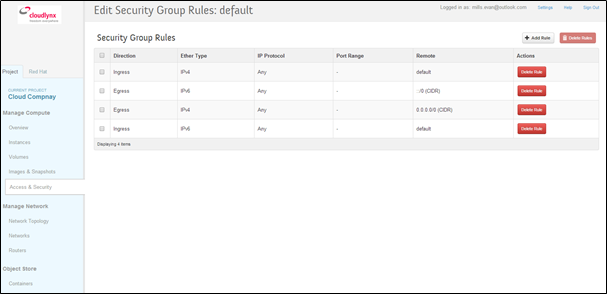

1. Klicken Sie auf den Menüunterpunkt **Access & Security**, den Sie unter **Manage Compute** finden.
2. Gehen Sie zum Reiter **Security Group** und klicken Sie auf die Schaltfläche **Edit Rules** der gewünschten Sicherheitsgruppe.

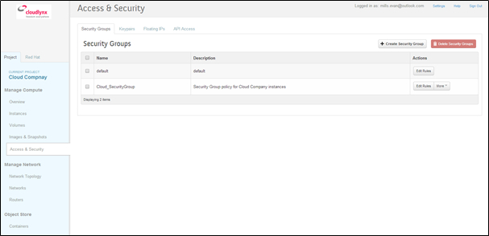

3. Klicken Sie auf die Schaltfläche **Add Rule**.
4. Nun erscheint das **Add Rule**-Popup-Fenster.

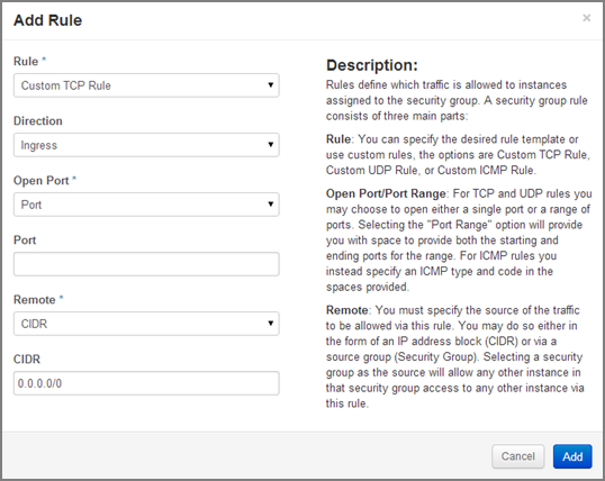

- **Rule**  – Wählen Sie aus der Dropdown-Liste die gewünschte Regelvorlage aus 
- **Direction** – Wählen Sie aus der Dropdown-Liste die Richtung aus.
- **Open Port** – Benutzen Sie dieses Fenster, um den Port (die Ports) zu definieren, auf den (die) die Regel angewendet werden soll.
- **Port** – Geben Sie hier einen bestimmten Port ein.  
      **Port Range** – Hier können Sie den Portbereich festlegen, indem Sie die Felder **von Port** und **zu Port** benutzen. 

* Remote – Mit dieser Regel können Sie die Quelle des erlaubten Verkehrs festlegen.
    * CIDR – Hier können Sie die Quelle des Verkehrs als IP-Adressenblock festlegen. 
    * Security Group – Wenn Sie eine Sicherheitsgruppe als Quelle auswählen, können alle anderen Instanzen in dieser Sicherheitsgruppe auf all die Instanzen zugreifen, für die die Verkehrsquelle durch eine Sicherheitsgruppe festgelegt ist.

5. Klicken Sie auf die Schaltfläche **Add**, um einer Sicherheitsgruppe einen neue Regel hinzufügen.
6. Sie müssen jetzt eine Regel hinzufügen, um Zugang über Port 22 (SSH) zu erlauben. Benutzen Sie dazu die Regel **Custom TCP**.
7. Fügen Sie auch eine ICMP-Regel hinzu – Zugang von überall
8. Die Regel wurde erfolgreich einer Sicherheitsgruppe hinzugefügt.
 
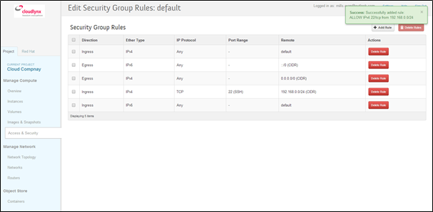
	  
.. note::
   Eine erstellte Regel kann später nicht mehr geändert werden. Wollen Sie sie ändern, müssen Sie sie löschen und eine neue Regel mit neuen Parametern erstellen. 

Floating IP's
-------------

Jede erstellte Instanz hat eine private IP-Adresse. Sie kann zudem eine öffentliche (Floating) IP-Adresse haben. Die private Adresse dient der Kommunikation zwischen den Instanzen, die öffentliche der Kommunikation mit Netzwerken ausserhalb der Cloud. Dazu gehört auch das Internet.

**Um Ihrem Projekt eine neue Floating IP hinzuzufügen, gehen Sie folgendermassen vor:**

1. Klicken Sie auf den Menüunterpunkt **Access & Security**, den Sie unter **Manage Compute** finden.
2. Klicken Sie auf den Reiter **Floating IPs**.

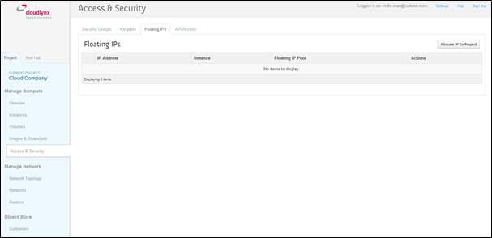
	  
3. Klicken Sie danach auf die Schaltfläche **Allocate IP to Project**.
4. Nun erscheint das **Floating IP**-Popup-Fenster.

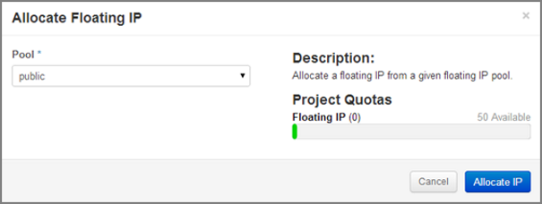
	  
5. Klicken Sie auf die Schaltfläche **Allocate IP**. Damit fügen Sie dem Floating-IP-Pool eine neue Adresse hinzu.

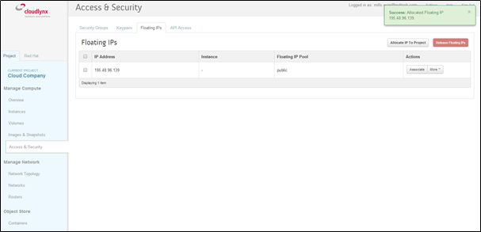
	  
6. Ihre neue Floating IP sehen Sie nun in der Floating-IP-Liste unter **Access & Security** im Teil **Manage Compute**.
7. Klicken Sie auf den Menüunterpunkt **Access & Security**, den Sie unter **Manage Compute** finden.
8. Klicken Sie auf den Reiter **Floating IPs**.
9. Klicken Sie auf die Schaltfläche **Associate** in der Floating-IP-Liste. Nun erscheint das **Manage Floating IP Associations**-Popup-Fenster.

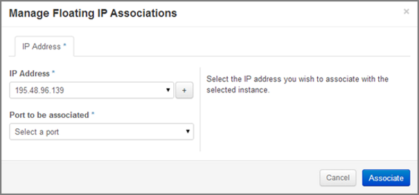
	  
10. Das Feld **IP Address** wird automatisch ausgefüllt. 
- Mit dem **+** können Sie eine neue IP-Adresse hinzufügen. Klicken Sie darauf. Mit dieser Option wird Ihrem Pool von Floating IPs eine neue Adresse hinzugefügt.
- Sie können eine andere IP-Adresse auch dadurch bestimmen, indem Sie das Dropdown-Menü öffnen und aus den möglichen IP-Adressen eine auswählen und Ihrem Projekt zuordnen.

11. Klicken Sie auf einen Port im Dropdown-Menü **Port to be associated** und weisen Sie ihn so Ihrer Floating IP zu. In der Liste sehen Sie alle Instanzen mit ihren fixen IP-Adressen.

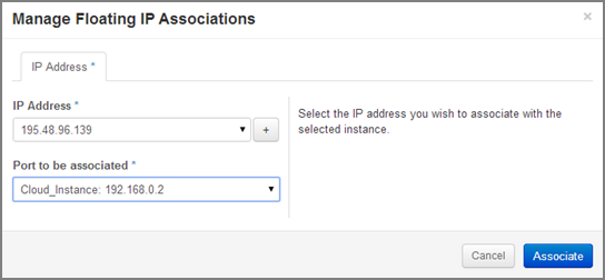
	  
12. Klicken Sie auf die Schaltfläche **Associate**.
13. Jetzt wird die IP-Adresse der Instanz zugewiesen.
14. Mit dieser IP-Adresse können Sie nun die Instanz über das Internet erreichen.

.. image:: _static/security/pic13.png
      :alt: Access & Security – successfully associated floating IP to an instance
