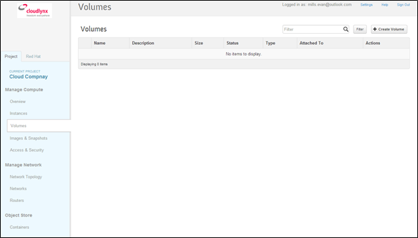
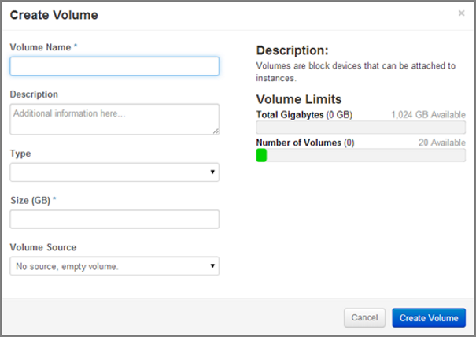
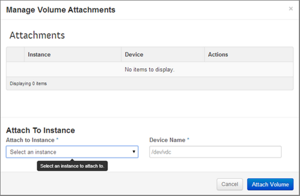
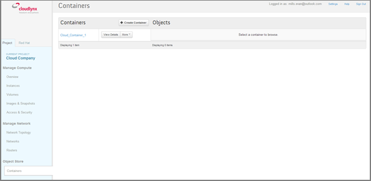
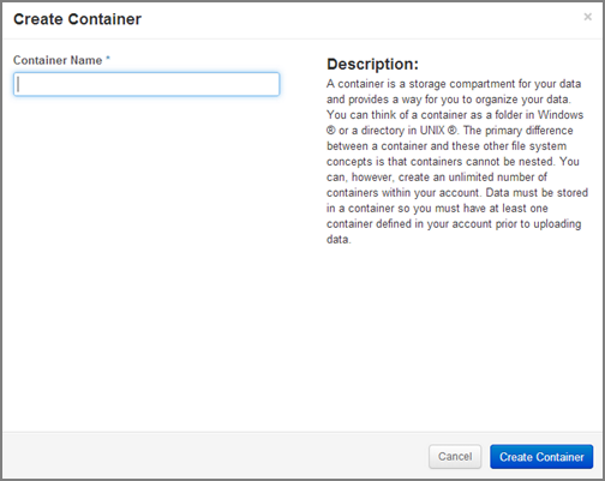
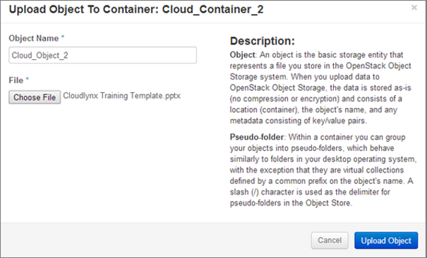
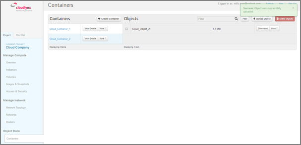
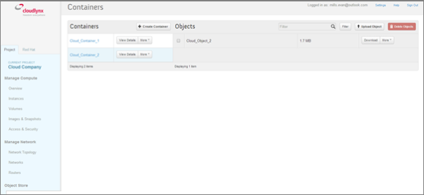
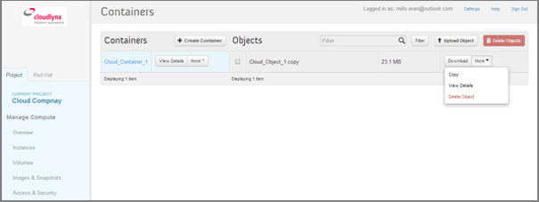
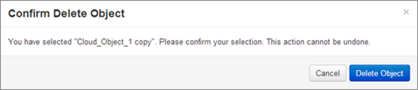

Datenspeicherung
================

Block Storage
-------------

Anlegen eines Volumes
^^^^^^^^^^^^^^^^^^^^^

1. Klicken Sie in der Seitenleiste auf den Reiter **Volumes** unter **Manage Compute**. In der Tabelle rechts sehen Sie alle Volumes, die bis jetzt erstellt wurden (wenn noch keins erstellt wurde, ist die Tabelle leer).

2. Klicken Sie auf die Schaltfläche **Create Volume** oben rechts.

3. Das Popup-Fenster **Create Volume** erscheint.

4. Volume Name – Geben Sie in das Feld einen passenden Namen für Ihr Volume ein.

5. Description – Hier können Sie das Volume beschreiben (optional).

6. Type – Lassen Sie das Feld **Type** leer. Diese Funktion wird noch nicht unterstützt.

7. Size (GB) – Geben Sie hier die gewünschte Anzahl GB für Ihr Volumen ein. Die noch zur Verfügung stehenden GB entnehmen Sie dem Balken **Total Gigabytes** unter **Volume Limits** auf der rechten Seite. 

8. Volume Source – Wählen Sie die Quelle des Volumes aus.

9. Wenn Sie **No source, empty volume** auswählen, wird ein leeres Volume erzeugt (vergleichbar zu einer unformattierten physischen Festplatte).

10. Klicken Sie auf die Schaltfläche **Create Volume**.

11. In der „Volumes“-Tabelle sehen Sie nun das von Ihnen erstellte Volume.

.. note::
   Wenn für Ihr Projekt noch keine Snapshots erzeugt wurden, werden Ihnen bei den Optionen unter **Volume Source** keine Snapshot-Optionen angezeigt.

.. note::
   Wenn Sie **No Source, empty volume** auswählen, enthält das Volume  weder ein Dateisystem noch eine Partitionstabelle.

Hinzufügen eines Volumes an eine Instanz
-----------------------------------------

Hinzufügen eines Volumes an eine Instanz über das Cloudlynx-Dashboard
^^^^^^^^^^^^^^^^^^^^^^^^^^^^^^^^^^^^^^^^^^^^^^^^^^^^^^^^^^^^^^^^^^^^^

1. Klicken Sie in der Seitenleiste auf **Volumes** unter **Manage Compute**.

2. Suchen Sie in der Tabelle rechts das Volume, das Sie hinzufügen wollen.

3. Klicken Sie auf die Schaltfläche **Edit Attachments** rechts der Tabelle unter **Actions**.

4. Das Fenster **Manage Volume Attachments** erscheints.

5. Wählen Sie aus dem Dropdown-Menü **Attach to Instance** die Instanz aus, zu der Sie das Volume hinzufügen wollen. Eine Instanz muss zuerst gestartet werden, bevor Sie ihr ein Volume hinzufügen können. Gibt es keine Instanz, ist die Liste leer.

6. Geben Sie bei **Device Name** den Namen des Geräts ein.

7. Klicken Sie auf **Attach Volume**.

8. In der Tabelle bei **Volumes** sehen Sie die Instanz, zu der das Volumen hinzugefügt wurde.

.. note::
   Einer einzigen Instanz können mehrere Volumes hinzugefügt werden. In Linux sollte der Name des Geräts in alphabetischer Ordnung angegeben werden. Bespiel: Das erste Volume heisst /dev/vdb, das zweite /dev/vdc usw.

Hinzufügen eines Volumes an eine Linux-Instanz
^^^^^^^^^^^^^^^^^^^^^^^^^^^^^^^^^^^^^^^^^^^^^^

Ein Volume wird einer Linux-Instanz in drei Schritten hinzugefügt:

1. Hinzufügen eines Volumes zu einer Instanz über das Cloudlynx-Dashboard

2. Initialisieren des Volumes

3. Einbinden (Mounten) eines Volumes in die Instanz

Initialisieren eines Volumes, das einer Linux-Instanz hinzugefügt wurde
"""""""""""""""""""""""""""""""""""""""""""""""""""""""""""""""""""""""

.. caution::
   Daten, die sich auf dem Volume befinden, gehen beim Initialisieren verloren. Aus diesem Grund sollten Sie diesen Schritt nur ausführen, wenn das Volume leer bzw. wenn das Volume das erste Mal hinzugefügt wird.

1. Verbinden Sie sich mit der Instanz über SSH.

2. Listen Sie alle Block-Storage-Geräte auf:

	$ lsblk

3. Suchen Sie den Namen des hinzugefügten Block-Storage-Geräts (zum Beispiel /dev/vdc).

4. Erstellen Sie auf dem Block-Storage-Gerät eine Partition.

5. Erstellen Sie ein Dateiensystem auf dem Gerät, indem Sie folgenden Befehl eingeben (für <device> geben Sie den Namen des hinzugefügten Block-Storage-Geräts ein, zum Beispiel /dev/vdc):

	$ sudo mkfs.ext4 <device>

.. note::
   Der Name des hinzugefügten Block Storage kann vom Betriebssystem der Instanz geändert werden, sollte der Name schon vergeben sein. 

   
Einbinden eines Volumes in eine Linux-Instanz
"""""""""""""""""""""""""""""""""""""""""""""

1. Erstellen Sie unter /media (dort, wo das Volume eingebunden werden soll) ein Verzeichnis, indem Sie folgenden Befehl ausführen, zum Bespiel:

       $ sudo mkdir –p /media/<volume name>

2. Binden Sie das Volume mit dem folgenden Befehl ein: 

       $ sudo mount <device> /media/<volume name>

Object Storage
--------------

Anlegen eines Containers
^^^^^^^^^^^^^^^^^^^^^^^^

1. Gehen Sie in der Seitenleiste bei **Object Store** zum Menüunterpunkt **Containers**.

2. In der Tabelle auf der rechten Seite sehen Sie alle Container, die bis jetzt erstellt wurden. Wurde noch kein Container erstellt, ist die Tabelle leer.

3. Klicken Sie auf die Schaltfläche **Create Container** in der Tabelle. Nun erscheint das **Create Container**-Popup-Fenster.

4. Füllen Sie nun das Feld **Container Name** aus. Geben Sie der Instanz zur einfachen Unterscheidung einen eindeutigen Namen.

.. note::
   Auf Gross- und Kleinschreibung achten.

5. Klicken Sie auf die Schaltfläche **Create Container**.

6. Der erstellte Object-Store-Container wird in der Tabelle bei **Containers** angezeigt.

.. image:: _static/storage/fig6.png
                  :alt: Containers Successfully Created Container  

				  

Speichern von Dateien in einem Container
----------------------------------------

1. Gehen Sie in der Seitenleiste bei **Object Store** zum Menüunterpunkt **Containers**.

2. Wählen Sie aus der Liste den Container aus, in den Sie die Datei hochladen wollen. 

.. image:: _static/storage/fig7.png
                  :alt: Containers – Upload an Object   

3. Klicken Sie auf die Schaltfläche **Upload Object** auf der rechten Seite. Sollten Sie die Fläche nicht sehen, klicken Sie auf den Namen des Containers. Nun erscheint das **Upload Object to Container**-Popup-Fenster.

4. Füllen Sie das Feld **Object Name** aus. Geben Sie der Instanz zur einfachen Unterscheidung einen eindeutigen Namen. Unter diesem Namen wird die Datei im Container abgelegt.

5. Wählen Sie eine Dateil aus, die Sie hochladen möchten.

6. Klicken Sie auf die Schaltfläche **Upoad Object**.

7. Die hochgeladene Datei wird in der Tabelle links in der Seite **Containers** angezeigt.

Herunterladen von Dateien aus einem Container
^^^^^^^^^^^^^^^^^^^^^^^^^^^^^^^^^^^^^^^^^^^^^

1. Gehen Sie in der Seitenleiste bei **Object Store** zum Menüunterpunkt **Containers**.

2. Wählen Sie aus der Liste den Container aus, aus dem Sie die Datei herunterladen wollen. 

3. Klicken Sie auf die Schaltfläche **Download** rechts der Datei, die sie herunterladen wollen. 

4. Der Download beginnt nun. Vielleicht werden Sie zuerst gefragt, wohin Sie die Datei speichern wollen. 

Löschen einer Datei in einem Container
^^^^^^^^^^^^^^^^^^^^^^^^^^^^^^^^^^^^^^

1. Gehen Sie in der Seitenleiste bei **Object Store** zum Menüunterpunkt **Containers**.

2. Wählen Sie aus der Liste den Container aus, in dem Sie die Datei löschen wollen. 

3. Klicken Sie auf die Option **Delete Object** aus dem Dropdown-Menü **More** rechts der zu löschenden Datei. Nun erscheint das **Confirm Delete Object**-Popup-Fenster.

4. Klicken Sie auf die Schaltfläche **Delete Object** und bestätigen damit Sie den Befehl.

.. note::
   Dieser Vorgang kann nicht rückgängig gemacht werden!

 
